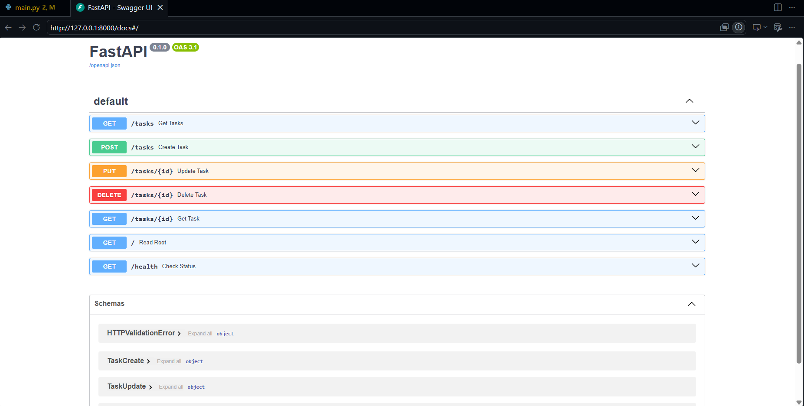

# W2-A1: Task CRUD API

This is a lightweight, in-memory CRUD (Create, Read, Update, Delete) API built using FastAPI as part of the FlyRank Backend Internship.

## How to Install & Run

1. **Clone the repository** to your local machine:
   ```bash
   git clone https://github.com/Abdullah-Tariq-10/FlyRank-Internship-Tasks
   cd FlyRank-Internship-Tasks
   ```

2. **Install the required dependencies**:
   ```bash
   pip install fastapi uvicorn
   ```

3. **Start the server**:
   ```bash
   uvicorn main:app --reload
   ```
   *The server will run locally at `http://localhost:8000/`.*

---

## API Endpoints

| HTTP Method | Path | Description | Expected Status Codes |
| --- | --- | --- | --- |
| **GET** | `/` | Get basic API metadata and available resource paths. | `200 OK` |
| **GET** | `/health` | Verify the API server is healthy and operational. | `200 OK` |
| **GET** | `/tasks` | Retrieve all tasks currently in the list. | `200 OK` |
| **GET** | `/tasks/{id}` | Retrieve a single task by its unique ID. | `200 OK`, `404 Not Found` |
| **POST** | `/tasks` | Create a brand new task and add it to the list. | `201 Created`, `400 Bad Request` |
| **PUT** | `/tasks/{id}` | Update an existing task's title and/or status. | `200 OK`, `400 Bad Request`, `404 Not Found` |
| **DELETE** | `/tasks/{id}` | Remove a task from the list by its unique ID. | `204 No Content`, `404 Not Found` |

---

## Sample curl Outputs

### 1. Get All Tasks (GET `/tasks`)

```bash
PS D:\flyrank-internship> curl.exe -i http://localhost:8000/tasks
HTTP/1.1 200 OK
date: Fri, 17 Jul 2026 03:19:00 GMT
server: uvicorn
content-length: 191
content-type: application/json

[{"id":1,"title":"Buy Groceries","done":false},{"id":2,"title":"Clean the car","done":true},{"id":3,"title":"Study Backend AI","done":false}]
```

### 2. Triggering a 404 Error (GET `/tasks/99`)

```bash
PS D:\flyrank-internship> curl.exe -i http://localhost:8000/tasks/99
HTTP/1.1 404 Not Found
date: Fri, 17 Jul 2026 03:19:10 GMT
server: uvicorn
content-length: 37
content-type: application/json

{"detail":{"error":"Task 99 not found"}}
```

---

## Swagger UI Interactive Documentation

FastAPI automatically serves your interactive API documentation at `http://localhost:8000/docs`. You can view, test, and run the full CRUD lifecycle directly from your browser.

