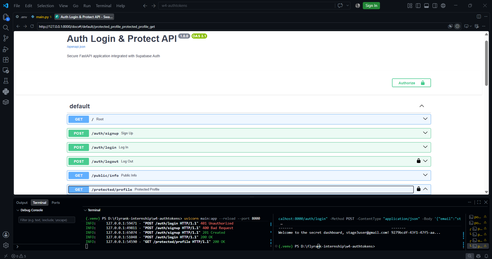

# Secure FastAPI Authentication with Supabase

A secure REST API built with FastAPI and Supabase Auth demonstrating stateless JWT verification, reusable dependency guards, session management, token refresh rotation, Role-Based Access Control (403 Forbidden), and interactive OpenAPI documentation.

---

## Architecture & The Trust Triangle

Authentication operates as a three-party trust model:

| Step | Flow | Action |
| :--- | :--- | :--- |
| **1. Authentication** | Client $\rightarrow$ Supabase | Client sends email and password credentials. |
| **2. Token Issuance** | Supabase $\rightarrow$ Client | Supabase verifies credentials and returns a signed JWT access token and refresh token. |
| **3. Request** | Client $\rightarrow$ FastAPI | Client attaches token via `Authorization: Bearer <access_token>` header. |
| **4. Verification** | FastAPI $\rightarrow$ Supabase | Backend validates token signature and integrity via `supabase.auth.get_user(token)`. |
| **5. Authorization** | FastAPI $\rightarrow$ Client | Reusable dependency injects user context and serves the protected resource (`200 OK`). |

---

## API Reference

| Method | Endpoint | Description | Auth Scheme | Status Codes |
| :--- | :--- | :--- | :--- | :--- |
| `GET` | `/` | Service health check | None | `200 OK` |
| `GET` | `/public/info` | Open public information route | None | `200 OK` |
| `POST` | `/auth/signup` | Register a new user account | None | `201 Created`, `400 Bad Request` |
| `POST` | `/auth/login` | Authenticate user and issue JWTs | None | `200 OK`, `400 Bad Request`, `401 Unauthorized` |
| `POST` | `/auth/refresh` | Exchange a refresh token for a new access token | None | `200 OK`, `400 Bad Request`, `401 Unauthorized` |
| `POST` | `/auth/logout` | Invalidate active user session | `Bearer <token>` | `204 No Content`, `400 Bad Request`, `401 Unauthorized` |
| `GET` | `/protected/profile` | Retrieve verified user profile metadata | `Bearer <token>` | `200 OK`, `401 Unauthorized` |
| `GET` | `/protected/dashboard` | Access secret dashboard payload | `Bearer <token>` | `200 OK`, `401 Unauthorized` |
| `GET` | `/protected/admin` | Admin-only route (RBAC demo) | `Bearer <token>` | `200 OK`, `401 Unauthorized`, `403 Forbidden` |

---

## Key Authentication Concepts

### 401 Unauthorized vs. 403 Forbidden
* **`401 Unauthorized` (Authentication Failure):** "I do not know who you are." The request lacked a valid token, used an invalid format, or presented an expired/tampered JWT.
* **`403 Forbidden` (Authorization Failure):** "I know who you are, but you do not have permission." The user is successfully authenticated, but lacks the necessary role or privileges for the requested resource (`/protected/admin`).

### Access Tokens vs. Refresh Tokens & Rotation
* **Access Tokens (Stateless & Short-Lived):** Cryptographically signed JWTs that expire quickly (default: 1 hour) to limit exposure if intercepted.
* **Refresh Tokens (Stateful & Long-Lived):** Secure tokens stored in Supabase to obtain fresh access tokens silently without prompting for passwords.
* **Single-Use Invalidation (Token Rotation):** Each refresh invalidates the used refresh token and issues a replacement. Reusing a spent refresh token triggers breach detection, rejecting the request with `401` and revoking the active session family.

---

## Setup & Installation

### 1. Prerequisites & Environment Setup
Clone the repository and configure your environment file:

```bash
git clone [https://github.com/Abdullah-Tariq-10/w4-authtokens.git](https://github.com/Abdullah-Tariq-10/w4-authtokens.git)
cd w4-authtokens
cp .env.example .env
```

Populate `.env` with your Supabase credentials:
```env
SUPABASE_URL=[https://your-project-id.supabase.co](https://your-project-id.supabase.co)
SUPABASE_KEY=your-supabase-anon-key
```

### 2. Install Dependencies
```bash
pip install -r requirements.txt
```

### 3. Run the Server
```bash
uvicorn main:app --reload --port 8000
```
*API Base URL:* `http://localhost:8000`

---

## Interactive Swagger UI Documentation

FastAPI serves interactive OpenAPI documentation at `http://localhost:8000/docs`. Protected endpoints feature padlock indicators and can be tested interactively using the green **Authorize** button with a Bearer JWT.

