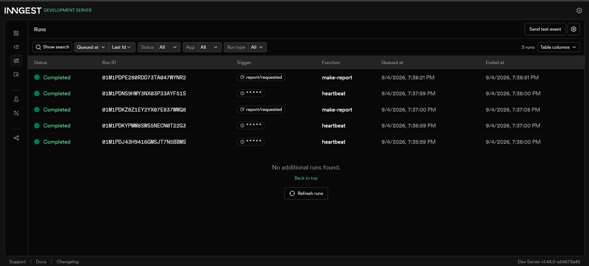

# Background Job Service (FastAPI + Inngest)

An asynchronous background job system built with FastAPI and Inngest. The API decouples slow processing from HTTP request-response loops by issuing immediate `202 Accepted` receipts, executing work across durable checkpointed steps with exponential backoff retries, and running scheduled heartbeat jobs via cron triggers[cite: 1].

---

## Running the Application

This service requires two concurrently running processes: the FastAPI web application and the Inngest Dev Server[cite: 1].

### Terminal 1: Start the API Server

```bash
python main.py

```

### Terminal 2: Start the Inngest Dev Server

```bash
npx inngest-cli@latest dev -u [http://127.0.0.1:8000/api/inngest](http://127.0.0.1:8000/api/inngest)

```

Once running, the Inngest local dashboard is accessible at `http://localhost:8288`.

---

## Endpoints and Background Functions

### API Endpoints

| Method | Path | Status Code | Description |
| --- | --- | --- | --- |
| `GET` | `/health` | `200 OK` | Service health status check |
| `POST` | `/reports` | `202 Accepted` / `400 Bad Request` | Validates input, records pending state, and dispatches job

 |
| `GET` | `/reports/{id}` | `200 OK` / `404 Not Found` | Status polling endpoint returning state and computed result

 |
| `GET` | `/reports` | `200 OK` | (Extra) Control panel listing all tracked jobs and statuses

 |

### Inngest Functions

| Function ID | Trigger | Type | Execution Behavior |
| --- | --- | --- | --- |
| `say-hello` | `test/hello` | Event | Durably sleeps for 5 seconds and returns confirmation text.

 |
| `make-report` | `report/requested` | Event | Sleeps for 8 seconds (`do-the-slow-work`), executes `build-report`, and retries up to 2 times on failures.

 |
| `heartbeat` | `* * * * *` | Cron | Wakes up every minute on the clock to log counts of pending, done, and failed jobs.

 |

---

## Execution Proof (Fast Door & Eventual Consistency)

### 1. Fast Door: Dispatched in Milliseconds (202 Accepted)

```http
POST /reports HTTP/1.1
Host: 127.0.0.1:8000
Content-Type: application/json

{"topic": "cats"}

HTTP/1.1 202 Accepted
date: Thu, 03 Sep 2026 05:32:42 GMT
server: uvicorn
content-length: 36
content-type: application/json

{"id": "127fd0e6", "status": "pending"}

```

### 2. Immediate Poll (~2s later)

```http
GET /reports/127fd0e6 HTTP/1.1
Host: 127.0.0.1:8000

HTTP/1.1 200 OK
content-type: application/json

{"id": "127fd0e6", "topic": "cats", "status": "pending"}

```

### 3. Final Poll After Completion (~10s later)

```http
GET /reports/127fd0e6 HTTP/1.1
Host: 127.0.0.1:8000

HTTP/1.1 200 OK
date: Thu, 03 Sep 2026 05:34:51 GMT
server: uvicorn
content-length: 112
content-type: application/json

{"id": "127fd0e6", "topic": "cats", "status": "done", "result": "Execute summary on cats: Market trends are positive."}

```

---

## Concept Questions & Explanations

### Stage 3: Retries vs. Input Validation

A wrong input must be rejected at the door with a 400 Bad Request because a deterministic bug will never succeed no matter how many times it is repeated; only a transient failure (a wrong moment) deserves an automatic retry with backoff.

### Stage 4: Cron Heartbeat Schedules

1. **Daily at 08:00:** The cron expression `0 8 * * *` executes the heartbeat task every day at 08:00 UTC (at minute 0 of hour 8).


2. **Weekly on Sunday at 22:00:** The cron expression `0 22 * * 0` executes the heartbeat task once a week specifically at 22:00 UTC every Sunday (at minute 0 of hour 22 on weekday 0).


### Extras: The Restart Experiment

When the FastAPI process was stopped mid-execution during the 8-second sleep step and restarted three seconds later, the background job did not crash or duplicate previous work. Because Inngest executes durable steps, the execution context survived the server outage and resumed cleanly from the checkpointed step once the API reconnected.

---

## Dashboard Proof

git push origin main

```
