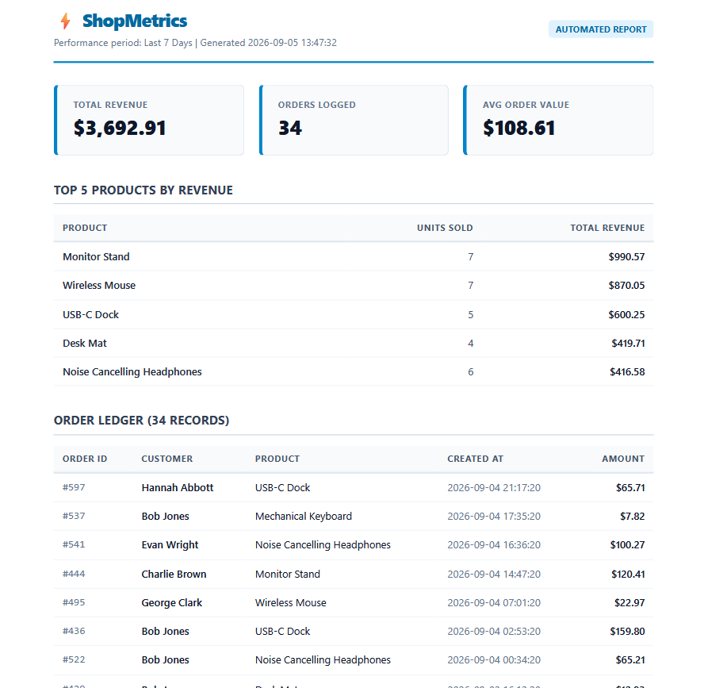

# W4 · A8 — Automated PDF Report Generator

An automated report generation pipeline built with Python, FastAPI, SQLite, and Playwright. The service aggregates tabular business data using SQL, compiles dynamic HTML templates into multi-page PDF documents with print-specific layout rules, enforces request idempotency, and delivers generated documents via a decoupled store-and-link design.

---

## Dataset Selection

**Option A: The Little Shop**
* Source: Local SQLite database (`report.db`) containing the `orders` table.
* Schema: `id` (INTEGER PRIMARY KEY), `customer` (TEXT), `product` (TEXT), `amount` (REAL), `created_at` (TEXT).
* Volume: 200 synthesized transaction records distributed across 6 hardware products over the past 30 days.

---

## How to Run

### 1. Environment Setup

```bash
python -m venv .venv
# Windows PowerShell:
.venv\Scripts\Activate.ps1
# macOS/Linux:
# source .venv/bin/activate

pip install fastapi uvicorn playwright pydantic
playwright install chromium

```

### 2. Seed the Database

Populate `report.db` with 200 idempotent order records:

```bash
python seed.py

```

*Verification query:*

```bash
python -c "import sqlite3; conn = sqlite3.connect('report.db'); print('Total orders:', conn.cursor().execute('SELECT COUNT(*) FROM orders').fetchone()[0]); conn.close()"
# Output: Total orders: 200

```

### 3. Start the API Server

```bash
uvicorn main:app --reload --port 8000

```

---

## Core Aggregation SQL

All analytical metrics are computed in SQLite via `report_data.py` prior to rendering:

```sql
-- 1. Total Orders & Total Revenue
SELECT COUNT(*) AS total_orders, 
       SUM(amount) AS total_revenue 
FROM orders 
WHERE created_at >= :window_cutoff;

-- 2. Top 5 Products by Gross Revenue
SELECT product, 
       ROUND(SUM(amount), 2) AS revenue, 
       COUNT(*) AS count
FROM orders
WHERE created_at >= :window_cutoff
GROUP BY product
ORDER BY revenue DESC
LIMIT 5;

-- 3. Daily Order Breakdown
SELECT strftime('%Y-%m-%d', created_at) AS day,
       COUNT(*) AS order_count,
       ROUND(SUM(amount), 2) AS day_revenue
FROM orders
WHERE created_at >= :window_cutoff
GROUP BY day
ORDER BY day ASC;

-- 4. Complete Raw Ledger (Forces Multi-Page PDF Overflow)
SELECT id, customer, product, amount, created_at
FROM orders
WHERE created_at >= :window_cutoff
ORDER BY created_at DESC;

```

---

## API Proofs: POST → Download

### 1. Generate Report (POST /reports)

```http
POST /reports HTTP/1.1
Host: localhost:8000
Content-Type: application/json

{"days": 30}

HTTP/1.1 201 Created
content-type: application/json

{"id": 4, "file": "/reports/4/file"}

```

### 2. Download Generated PDF Artifact (GET /reports/:id/file)

```powershell
curl.exe -i http://localhost:8000/reports/4/file

```

```http
HTTP/1.1 200 OK
content-type: application/pdf
content-disposition: inline; filename="sales-report-2026-09-05-id4.pdf"
content-length: 124982

```

Saving directly to disk:

```powershell
curl.exe -o downloaded_report.pdf http://localhost:8000/reports/4/file

```

---

## Required Concept Questions

### Stage 4: Moving Generation Out of the Request

> Move report generation out of the request and into an asynchronous background queue when the report processing duration degrades HTTP request thresholds (typically $>1\text{--}2$ seconds), when concurrent user requests exhaust server worker threads, or when datasets grow large enough that browser rendering risks request timeouts.
> 
> 

### Stage 5: Purpose of the Idempotency Check

> The daily idempotency check protects server resources against redundant, heavy browser-rendering jobs, excess disk consumption, and database row bloat caused by users repeatedly double-clicking report triggers. A real-world example where a missing check directly costs money is automated payment processing or notifications—such as double-charging a customer's credit card or triggering duplicate bill delivery emails when an invoice generation endpoint is tapped multiple times.
> 
> 

---

## Generated Report Preview
